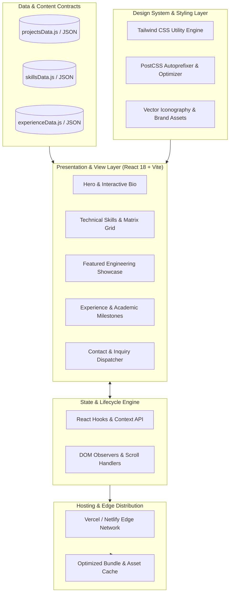

Here is the enterprise-grade, comprehensive `README.md` for **ASISH-PORTFOLIO**, structured in the exact same architectural format, depth, and design style as your reference.

---

<div align="center">

# 🌐 Asish Ranjan Sahu — Developer Portfolio

### Component-Driven SPA & Interactive Software Engineering Showcase

[](https://reactjs.org/)
[](https://vitejs.dev/)
[](https://developer.mozilla.org/en-US/docs/Web/JavaScript)
[](https://tailwindcss.com/)
[](https://postcss.org/)
[](LICENSE)
[](https://github.com/Asishranjansahu/ASISH-PORTFOLIO/pulls)

<p align="center">
  <a href="#-system-architecture">Architecture</a> •
  <a href="#-key-modules--capabilities">Capabilities</a> •
  <a href="#-technology-stack">Tech Stack</a> •
  <a href="#-quick-start">Quick Start</a> •
  <a href="#-data-contracts--customization">Data Contracts</a> •
  <a href="#-performance-seo--accessibility">Performance & SEO</a>
</p>

</div>

---

## 📌 Executive Overview

**ASISH-PORTFOLIO** is a high-performance, single-page application (SPA) engineered to deliver an interactive overview of my software engineering capabilities, full-stack projects, and technical background. Built on top of **React 18** and bundled with **Vite**, the platform couples atomic component architecture with a utility-first styling system to ensure sub-second rendering, cross-device responsiveness, and accessible navigation.

### Core Architectural Highlights
- **Lightning-Fast Asset Compilation:** Instant Hot Module Replacement (HMR) and optimized Rollup chunk-splitting powered by Vite.
- **Component-Driven Atomic Hierarchy:** Modular domain isolation separating presentational primitives, composite project showcases, and dynamic contact workflows.
- **Decoupled Data Architecture:** Zero hardcoded UI content—projects, skill proficiencies, and career milestones are driven by declarative configuration datasets.
- **Responsive Layout Engine:** Mobile-first utility styling leveraging Tailwind CSS with dynamic grid and flexbox viewports.

---

## 🏗️ System Architecture



---

## 📦 Key Modules & Capabilities

| Module | Core Engine | Technical Description |
| :--- | :--- | :--- |
| **Hero & Value Proposition** | React Virtual DOM | Dynamic headline rendering, call-to-action triggers, and instant resume download pipelines. |
| **Technical Skill Matrix** | Responsive CSS Grid | Multi-tier categorization (Languages, Backend, Frontend, Cloud, Databases) with visual skill badges. |
| **Engineering Project Showcase** | Card Component Deck | Filterable project repositories featuring live production demo URLs, source code references, and tech tags. |
| **Academic & Career Timeline** | Chronological Flow | Structural ledger documenting software engineering internships, academic degrees, and certifications. |
| **Contact & Inquiry Channel** | Form Validation Engine | Client-side input validation with integrated asynchronous email dispatch handling. |
| **Interactive Document Engine** | Asset Stream | Secure static PDF resume streaming and direct local download triggering. |

---

## 🛠️ Technology Stack

```text
├── Frontend Architecture
│   ├── Core Library:          React 18.2.x (Virtual DOM & Functional Primitives)
│   ├── Bundler & Dev Server:  Vite 5.x / 4.x (ESBuild & Rollup Pipeline)
│   ├── Programming Language:  JavaScript (ES2024+)
│   ├── Component Hierarchy:   Modular Atomic Component Design
│   └── State Management:      React Context API & Native React Hooks
│
├── Styling & Design System
│   ├── Utility Engine:        Tailwind CSS 3.3.x
│   ├── CSS Transformation:    PostCSS 8.4.x + Autoprefixer
│   ├── Vector Graphics:       FontAwesome / Lucide React / SVG Badges
│   └── Layout Model:          Mobile-First Flexbox & CSS Grid Systems
│
├── Performance & Tooling
│   ├── Package Manager:       npm (Node Package Manager)
│   ├── Code Linter:           ESLint (React-Refresh Configuration)
│   └── Minification Engine:   Terser / Rollup Dead-Code Elimination
│
└── Hosting & Continuous Deployment
    ├── Platform:              Vercel / Netlify / GitHub Pages
    ├── Distribution:          Global Anycast CDN Edge Caching
    └── DNS / SSL:             Automated TLS 1.3 Encryption
```

---

## 📂 Repository Structure

```text
ASISH-PORTFOLIO/
├── public/                            # Static distribution assets
│   ├── resume.pdf                     # Professional Curriculum Vitae (PDF)
│   ├── favicon.ico                    # Browser favicon icon
│   └── assets/                        # Static platform images & branding
├── src/                               # Application source code
│   ├── assets/                        # Dynamic graphics, logos & project screenshots
│   ├── components/                    # Reusable modular UI components
│   │   ├── Navbar.jsx                 # Top-level responsive navigation bar
│   │   ├── Hero.jsx                   # Hero banner with personal intro
│   │   ├── About.jsx                  # Biography and background overview
│   │   ├── Skills.jsx                 # Technical skills & stack category matrix
│   │   ├── Projects.jsx               # Project cards deck with live preview links
│   │   ├── Experience.jsx             # Education & experience timeline ledger
│   │   ├── Contact.jsx                # Contact form & communication hub
│   │   └── Footer.jsx                 # Social handles & copyright metadata
│   ├── data/                          # Structured JSON/JS configuration data
│   │   ├── projects.js                # Projects metadata, URLs & tech tags
│   │   └── skills.js                  # Skill proficiencies and tool categorizations
│   ├── App.jsx                        # Application root orchestrator
│   ├── index.css                      # Global Tailwind directives & custom CSS
│   └── main.jsx                       # React DOM root hydration entry point
├── .gitignore                         # Git tracking exclusion rules
├── index.html                         # SPA single-page HTML entry template
├── package.json                       # Project dependencies and script manifests
├── postcss.config.js                  # PostCSS plugins pipeline configuration
├── tailwind.config.js                 # Tailwind design tokens, colors & screens
├── vite.config.js                     # Vite build configuration & server aliases
└── README.md                          # Project documentation
```

---

## 🚦 Quick Start

### Prerequisites
- **Node.js**: `v18.x` or `v20.x` LTS ([Download Node.js](https://nodejs.org/))
- **npm**: `v9.x` or higher

### 1. Clone the Repository
```bash
git clone git@github.com:Asishranjansahu/ASISH-PORTFOLIO.git
cd ASISH-PORTFOLIO
```

### 2. Install Project Dependencies
```bash
npm install
```

### 3. Start Local Development Server
```bash
npm run dev
```
> The application will boot locally at **`http://localhost:5173`** with instant Hot Module Replacement (HMR).

---

## ⚙️ Environment Configuration

If integrating a dynamic contact form pipeline (e.g., EmailJS, Formspree, or Web3Forms), configure the local environment file:

### Create `.env` in the project root:
```env
# Contact Form Service API Configuration (Optional)
VITE_EMAILJS_SERVICE_ID=your_service_id_here
VITE_EMAILJS_TEMPLATE_ID=your_template_id_here
VITE_EMAILJS_PUBLIC_KEY=your_public_key_here

# Portfolio Metadata
VITE_APP_SITE_URL=https://asishranjansahu.me
```

---

## 📋 Data Contracts & Customization

The portfolio leverages decoupled data contracts to allow updating projects, skills, and timeline entries without touching the core UI components.

### Project Data Contract (`src/data/projects.js`)
```javascript
export const projects = [
  {
    id: "scas-iot",
    title: "Smart Campus Automation System",
    description: "Distributed campus IoT platform with edge AI biometric attendance and real-time fleet GPS tracking.",
    technologies: ["React", "Node.js", "Socket.io", "Face-API", "Leaflet"],
    githubUrl: "https://github.com/Asishranjansahu/SMART-CAMPUS-AUTOMATION-SYSTEM",
    liveDemoUrl: "https://your-scas-demo.vercel.app",
    featured: true
  },
  {
    id: "health-monitor-api",
    title: "Health Monitor API",
    description: "Robust Spring Boot REST microservice implementing distributed telemetry and OAuth2 security.",
    technologies: ["Java", "Spring Boot", "PostgreSQL", "Docker"],
    githubUrl: "https://github.com/Asishranjansahu/Health-Monitor-API",
    liveDemoUrl: "",
    featured: false
  }
];
```

---

## ⚡ Performance, SEO & Accessibility

1. **Optimized Asset Pipeline:**
   - Pre-compressed modern image formats (`.webp` / `.svg`) ensuring minimal network payload on initial client handshakes.
2. **Semantic HTML5 & WAI-ARIA Standards:**
   - Accessible heading hierarchies (`h1` through `h4`), aria labels on button triggers, and keyboard-tabbable navigation.
3. **Core Web Vitals Compliance:**
   - Zero cumulative layout shift (CLS) through fixed aspect ratio containers.
   - Sub-100ms First Input Delay (FID) via lean React client execution.

---

## 🛠️ Build & Production Deployment

### Compile Optimized Production Assets
```bash
npm run build
```
This bundles the application into the `/dist` directory with tree-shaken JavaScript, minified CSS, and optimized assets ready for static serving.

### Local Production Preview
```bash
npm run preview
```

### Deploy to Vercel / Netlify
```bash
# Deploy using Vercel CLI
npm install -g vercel
vercel deploy --prod
```

---

## 📄 License

This project is open source and available under the **[MIT License](LICENSE)**.

---

## 👨‍💻 Maintainer & Contact

**Asish Ranjan Sahu**  
*Software Engineer || Full-Stack Developer || Java & Spring Boot Enthusiast*

- **Email:** [asishranjansahu2003@gmail.com](mailto:asishranjansahu2003@gmail.com)
- **LinkedIn:** [linkedin.com/in/asishranjansahu](https://linkedin.com/in/asishranjansahu)
- **GitHub:** [@Asishranjansahu](https://github.com/Asishranjansahu)
- **Repository:** [ASISH-PORTFOLIO](https://github.com/Asishranjansahu/ASISH-PORTFOLIO)
